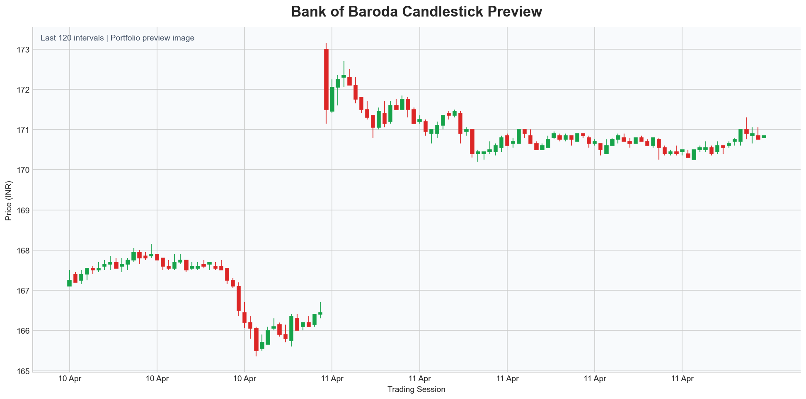

# Bank of Baroda Candlestick Dashboard

Interactive stock market visualization project built with `Python`, `Pandas`, and `Plotly` to analyze Bank of Baroda price movement through a clean candlestick dashboard.

This project transforms raw OHLCV stock data into an interactive financial chart that can be explored in Jupyter Notebook and shared as a standalone HTML file.

## Highlights

- Interactive candlestick dashboard for Bank of Baroda stock data
- Clean preprocessing pipeline for date and OHLCV values
- Notebook-based workflow that is easy to follow and reproduce
- Export-ready HTML chart for browser viewing and portfolio sharing

## Preview



The live interactive output is exported as:

- `bankbaroda_candlestick_dashboard.html`

## Key Features

- Reads raw stock market data from CSV
- Cleans date, price, and volume fields using Pandas
- Builds an interactive Plotly candlestick visualization
- Exports the final chart as a shareable HTML dashboard
- Demonstrates a simple and practical time-series analysis workflow

## Project Structure

- `index.ipynb` - main notebook containing the complete workflow
- `bankbaroda_stock_data.csv` - source stock dataset
- `bankbaroda_candlestick_dashboard.html` - exported interactive Plotly chart
- `requirements.txt` - project dependencies
- `assets/bankbaroda-preview.png` - static preview image for the README

## Tech Stack

- Python
- Pandas
- Plotly
- Jupyter Notebook

## Workflow

1. Import the required libraries.
2. Load the Bank of Baroda stock dataset.
3. Clean and preprocess the date and OHLCV columns.
4. Build the candlestick chart with Plotly.
5. Export the chart as an interactive HTML file.

## Run Locally

Install dependencies:

```bash
pip install -r requirements.txt
```

Open the notebook:

```bash
jupyter notebook index.ipynb
```

Run all cells to regenerate the visualization and HTML export.

## What This Project Demonstrates

- working with real stock market data
- cleaning and transforming time-series datasets
- building financial visualizations with Plotly
- turning notebook output into a portfolio-ready deliverable

## Future Improvements

- add moving averages and other technical indicators
- include a volume subplot below the candlestick chart
- support multiple stocks from different CSV files
- convert the notebook into a Streamlit or Dash application

## Author

**Anuj Ojha**

- GitHub: [Anuj7411](https://github.com/Anuj7411)

## Pin This Repo

If you want this project to stand out on your GitHub profile, pin it from your profile page so recruiters and visitors see it first.

## Disclaimer

This project is for educational and portfolio purposes only. It is not financial advice.

## License

This project is licensed under the MIT License. See the [LICENSE](LICENSE) file for details.
